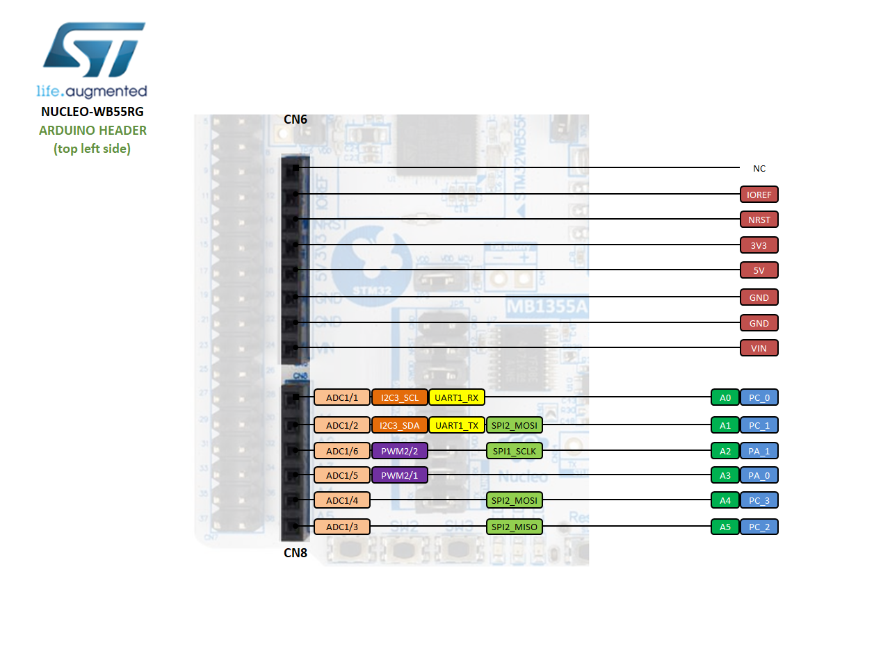
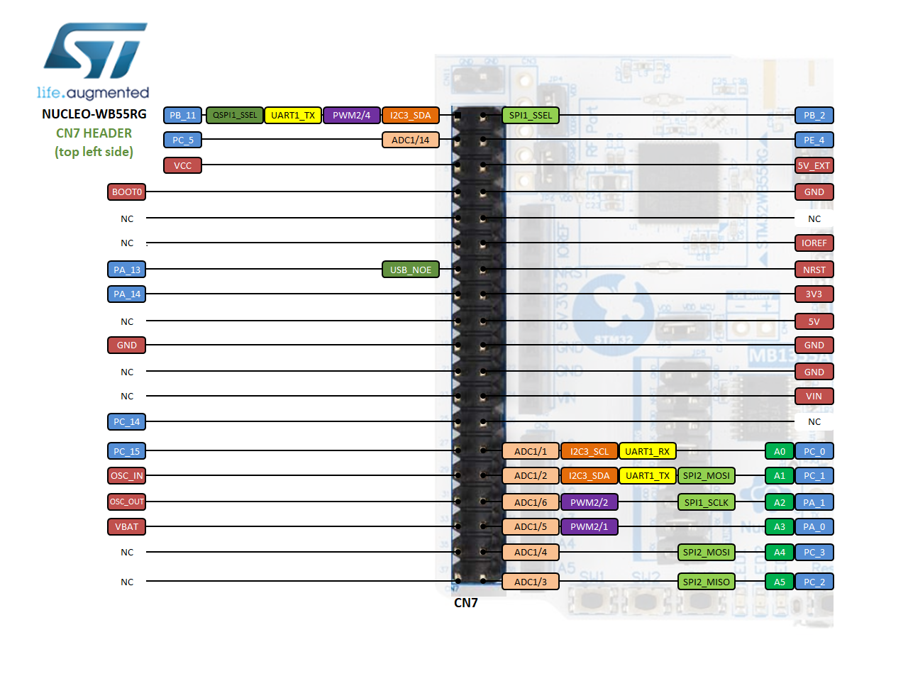

# STMicroelectronics NUCLEO-WB55RG

## Overview

The NUCLEO-WB55RG is a multi-protocol wireless and ultra-low-power device embedding a powerful and ultra-low-power radio compliant with the Bluetooth® Low Energy (BLE) SIG specification v5.0 and with IEEE 802.15.4-2011. This Nucleo-64 is available as a standalone NUCLEO-WB55RG product but also integrated into the P-NUCLEO-WB55 product pack. The NUCLEO-WB55RG allows to simply and quickly evaluate STM32WB55xx and STM32WB35xx devices.

## Board pinout

### Arduino-compatible headers

### Morpho headers

These headers give access to all STM32 pins.

## ST-LINK driver installation and firmware upgrade

1. Download the latest [ST-LINK driver](https://www.st.com/en/development-tools/stsw-link009.html) (Windows only).
2. Extract the archive and run `dpinst_amd64.exe`. Follow the displayed instructions.
3. Download the latest [ST-LINK firmware upgrade](https://www.st.com/en/development-tools/stsw-link007.html) (Linux/Mac OS/Windows).
4. Extract the archive and run the STLinkUpgrade application.
5. Connect the board to your PC using a USB cable and wait until the USB enumeration is completed.
6. In the **ST-Link Upgrade** program, press the **Device Connect** button.
7. The current ST-LINK version should be displayed.
8. Press the **Yes >>>>** button to start the firmware upgrade process.

## Technical references

- [STM32WB55RG microcontroller](https://www.st.com/en/microcontrollers-microprocessors/stm32WB55RG.html)
- [NUCLEO-WB55RG](https://www.st.com/en/evaluation-tools/nucleo-WB55RG.html)
