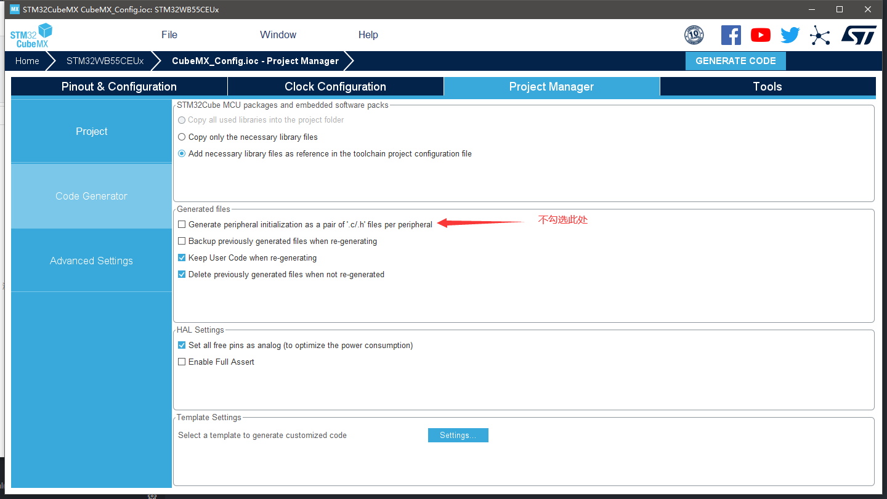

# bsp目录使用说明

## [CubeMX_config]

> CubeMX_config 文件夹下放置由CubeMX 工具生成的硬件初始化配置文件

- 将项目中所需要的外设及组件在CubeMx中配置完成
- 切换至Project Manager栏，配置如下图所示，需注意标注的重点选项

    

- 点击 **GENERATE CODE** 按钮生成初始化代码

- 代码生成后，外设初始化所需源文件将存放在Core/Src目录下

  - **`main.c`**

    *包含了所有配置好的外设的初始化函数，可将初始化函数按需拷贝和使用*

    **请将以下文件添加至项目工程的bsp目录下**

  - **`stm32wbxx_hal_msp.c`**

    *包含了所有配置好的外设在初始化过程中所需要的 **`MspInit`** 函数*

  - **`stm32wbxx_it.c`**

    *包含了所有中断的入口函数*

  - **`syscalls.c`**
  - **`sysmem.c`**
  - **`system_stm32wbxx.c`**

    *包含了系统预初始化过程中所需的 **`SystemInit`** 函数*

- 最后请将 **`main.c`** 中定义的所有外设结构体变量移植至 **`stm32wbxx_it.c`** 中，如下：

  1. 从 **`main.c`** 中复制以下外设结构体变量

        ```c
        ...
        ...
        /*Private variables ---------------------------------------------------------*/
        ADC_HandleTypeDef hadc1;

        CRC_HandleTypeDef hcrc;

        IPCC_HandleTypeDef hipcc;

        LPTIM_HandleTypeDef hlptim1;

        RNG_HandleTypeDef hrng;

        RTC_HandleTypeDef hrtc;

        SPI_HandleTypeDef hspi1;
        DMA_HandleTypeDef hdma_spi1_rx;
        DMA_HandleTypeDef hdma_spi1_tx;

        UART_HandleTypeDef huart1;
        DMA_HandleTypeDef hdma_usart1_rx;
        DMA_HandleTypeDef hdma_usart1_tx;

        /*USER CODE BEGIN PV*/

        /*USER CODE END PV*/

        /*Private function prototypes -----------------------------------------------*/
        ...
        ...

        ```

  2. 粘贴至 **`stm32wbxx_it.c`** 中 以 **``/*USER CODE BEGIN PV*/``** 和 **``/*USER CODE END PV*/``**包裹的代码段中

        ```c
        ...
        ...
        /* Private variables ---------------------------------------------------------*/

        /*USER CODE BEGIN PV*/
        ADC_HandleTypeDef hadc1;

        CRC_HandleTypeDef hcrc;

        IPCC_HandleTypeDef hipcc;

        LPTIM_HandleTypeDef hlptim1;

        RNG_HandleTypeDef hrng;

        RTC_HandleTypeDef hrtc;

        SPI_HandleTypeDef hspi1;
        DMA_HandleTypeDef hdma_spi1_rx;
        DMA_HandleTypeDef hdma_spi1_tx;

        UART_HandleTypeDef huart1;
        DMA_HandleTypeDef  hdma_usart1_rx;
        DMA_HandleTypeDef  hdma_usart1_tx;
        /*USER CODE END PV*/

        /*Private function prototypes -----------------------------------------------*/
        ...
        ...

        ```

  3. 在 **`stm32wbxx_it.c`** 中 删除相关变量声明

        ```cpp
        ...
        ...
        /* External variables --------------------------------------------------------*/

        extern ADC_HandleTypeDef   hadc1;
        extern IPCC_HandleTypeDef  hipcc;
        extern LPTIM_HandleTypeDef hlptim1;
        extern DMA_HandleTypeDef   hdma_spi1_rx;
        extern DMA_HandleTypeDef   hdma_spi1_tx;
        extern DMA_HandleTypeDef   hdma_usart1_rx;
        extern DMA_HandleTypeDef   hdma_usart1_tx;
        extern UART_HandleTypeDef  huart1;
        ...
        ...

        ```

## **`mcu_adapter.h`**

> MCU 适配文件

## **`ymconfig.h`**

> 工程配置文件
