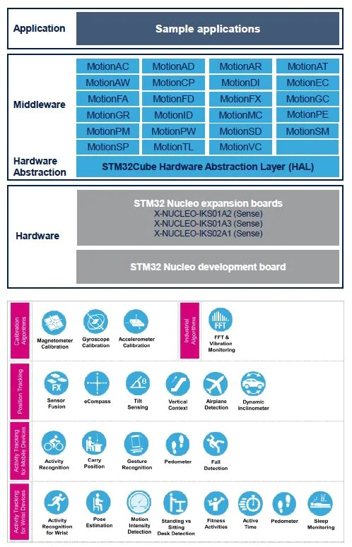

# components/ST 组件层应用说明

## [X-CUBE-MEMS1](https://www.st.com/zh/embedded-software/x-cube-mems1.html)

该软件提供了各种示例应用和高级运动库

- MotionAC 加速度计校准
- MotionAD 飞机检测
- MotionAR 活动识别
- MotionAT 活动时间
- MotionAW 腕部活动识别
- MotionCP 实时携带位置
- MotionDI 动态测斜仪
- MotionEC 实时电子罗盘
- MotionFA 健身活动
- MotionFD 实时跌落检测
- MotionFX 传感器融合
- MotionGC 陀螺仪校准
- MotionGR 实时手势识别
- MotionID 运动强度检测
- MotionMC 磁力计校准
- MotionPE 实时姿态估算
- MotionPM 实时计步器库
- MotionPW 腕部实时计步器
- MotionSD 站姿和坐姿检测
- MotionTL 倾斜测量
- MotionVC 垂直环境库

## STM32_WPAN

该组件移植自 [STM32CubeWB software]/Middlewares/ST/STM32_WPAN，提供了BLE层的通讯API
